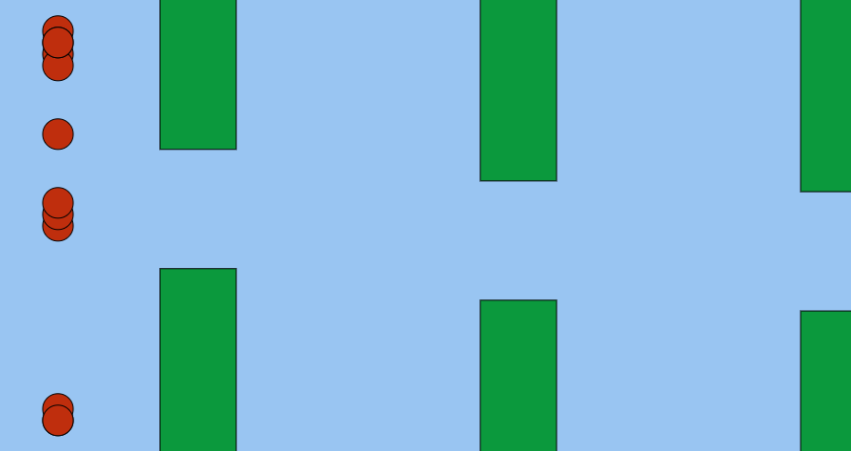
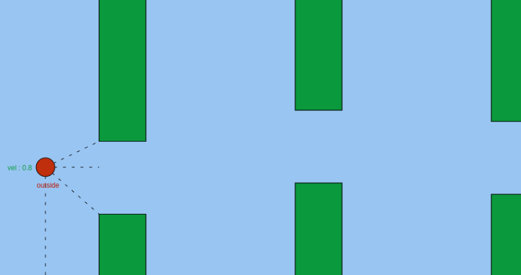

# NeuroEvolution
---

Neuro Evolution is the combination of Genetic Algorithm and Neural Networks to find a proper model. 

The Neural network is responsible for decision making in a population. Then each bird in the population is initialised with different neural networks and the genetic algorithm finds which neural network performs well after generations of selection and cross over. 

## Genetic Algorithm Implementation
---

The Implementation of genetic algorithm is from taken from my [github Repo](thivinanandh.github.io/Genetic_Algorithm)

## Neural net Implementation 
---

The Neural network is implemented purely using Vanila JS. Datastructures such as Vectors and Tensors are created internally to perform the operations related to the forward pass in Neural network. Further all the elements of the Neural network are implemented using Object Oriented programming ( seperate classes for neurons, layers, Activation Functions, etc). This modularisation of code was esssential to retrive the raw data such as weights and biasses of the entire model, which will be usefull during the cross over routines

### Cross Over Routines
---

The Cross over for neural network is generally perfomed by swapping certain regions of weights and biasses between two neural Networks. The weights and biasses from both the networks will be flattened (seperately) and will be sent to the cross over routine.  However, this might not be an effective solution most of the time, rather a simple mutation (randomly change random weights or biasses) within a population, which will be sufficient. 

## Flappy Bird
---

The game physics and the graphics is mostly inspired from Daniel Shiffman's youtube channel (Coding train). however the neural network part is implemented on my own for my requirements. 

## Features of Game
---

* Collision Detection
* Bird Physics
* Canvas Rendering (p5.js)

### NeuroEvolution Training 
---

The Game generates a n number of birds(population), with a neural network each initialised with random weights. Then all the population are allowed to play the game untill the last person surives. If all birds die, then a group of birds who have made it farthest will be choosen and will be crossed over or mutated to form newer generation of birds and the trainning continues. 

**click on the image to play online**

### What does the NeuralNetwork sees to make decision (Visual Representation)
---

This code visually presents the information that has been feed to the neural network for decison making, these involves parameters such as 

* distance to the top bar
* distance to the bottom bar
* velocity of the bird
* whether its present inside or outside the bar

**click on the image to play online**

