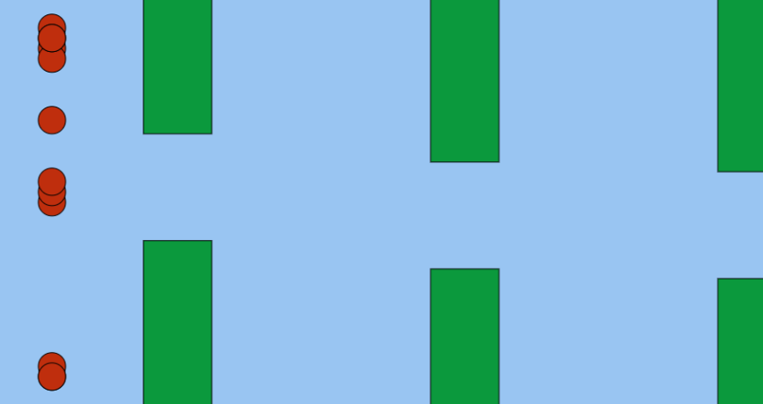

## Flappy Bird
---

The game physics and the graphics is mostly inspired from Daniel Shiffman's youtube channel (Coding train). however the neural network part is implemented on my own for my requirements. 

### NeuroEvolution Training 
---
The Game generates a n number of birds(population), with a neural network each initialised with random weights. Then all the population are allowed to play the game untill the last person surives. If all birds die, then a group of birds who have made it farthest will be choosen and will be crossed over or mutated to form newer generation of birds and the trainning continues. 
**click on the image to play online**

